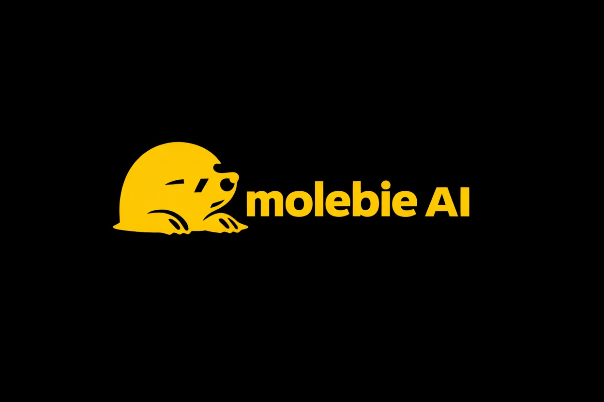
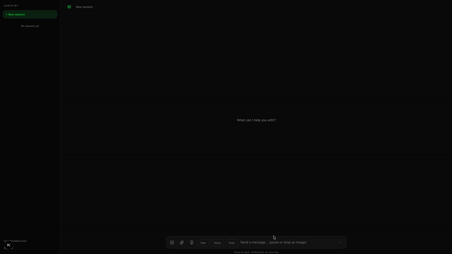

<p align="center">
  
</p>

<p align="center">
  <a href="https://github.com/Jimmy6929/Molebie_AI/actions/workflows/ci.yml"></a>
  <a href="https://github.com/Jimmy6929/Molebie_AI/actions/workflows/codeql.yml"></a>
  <a href="https://github.com/Jimmy6929/Molebie_AI/actions/workflows/secret-scan.yml"></a>
  <a href="https://github.com/Jimmy6929/Molebie_AI/actions/workflows/test-installer.yml"></a>
</p>

<p align="center">
  <a href="LICENSE"></a>
  
  
  <a href="CONTRIBUTING.md"></a>
</p>

<p align="center">
  A self-hosted AI assistant with voice conversation, vision, RAG document memory, and web search.<br>
  <strong>Private. Fast. Yours.</strong>
</p>

<p align="center">
  
</p>

## Features

- **Three Inference Modes** — Instant (fast), Thinking (chain-of-thought), Think Harder (extended reasoning)
- **Voice Conversation** — Wake-word activation, speech-to-text (Whisper), text-to-speech (Kokoro), speaker verification
- **Image Understanding** — Attach images via file picker, paste, or drag-and-drop
- **RAG Document Memory** — Upload PDFs, DOCX, TXT, MD for persistent knowledge with hybrid vector + BM25 search, cross-encoder reranking, neighbor expansion, and adaptive rerank floor
- **Folder Upload** — Drag a whole folder into Brain; live progress, dedup by content hash, resumable ingest
- **Vault Sync (Obsidian-style)** — Connect external folders as live sources; SHA-256 hash-diffed sync adopts unattached docs and ingests changes incrementally with allow-list / ignore-globs / size-limit / symlink safety
- **Hallucination Guards** — Built-in verification pipeline: Chain-of-Verification (CoVe), LLM Judge, SelfCheck consistency, citation enforcement, and tool-aware routing
- **Web Search** — Self-hosted SearXNG with LLM-powered intent classification and source citation
- **Live Terminal Monitor** — `molebie-ai monitor` shows real-time system, gateway, and inference health in one dashboard
- **Full Data Ownership** — All data stored locally in SQLite with file-based storage
- **Multi-User** — User isolation from day one, no cloud dependency
- **Any Backend** — Works with MLX, Ollama, vLLM, llama.cpp, or OpenAI API

## Install

```bash
curl -fsSL https://raw.githubusercontent.com/Jimmy6929/Molebie_AI/main/install.sh | bash
```

Or from source:

```bash
git clone https://github.com/Jimmy6929/Molebie_AI.git
cd Molebie_AI
./install.sh
```

<p align="center">
  
</p>

## Quick Start

```bash
molebie-ai run
```

Auto-detects your system, picks models for your RAM, generates config, and starts all services. Open **http://localhost:3000** and start chatting.

For more control, run `molebie-ai install` to use the interactive setup wizard.

## CLI

| Command | Description |
|---------|-------------|
| `molebie-ai run` | Start all services — auto-configures on first run |
| `molebie-ai install` | Interactive setup wizard |
| `molebie-ai doctor` | Diagnose problems — checks deps, config, and services |
| `molebie-ai status` | Show current config and running services |
| `molebie-ai monitor` | Live terminal dashboard — system, gateway, and inference health |
| `molebie-ai config env` | List all environment variables |
| `molebie-ai config set KEY=VALUE` | Update a config value |
| `molebie-ai model list` | Show available models and download status |
| `molebie-ai model add 9b` | Download a model |
| `molebie-ai feature add voice` | Enable a feature (also: `search`, `rag`) |

See [Configuration](docs/configuration.md) for the full command reference.

## Documentation

- [Architecture](docs/architecture.md) — System diagram, project structure, multi-machine setup
- [API Reference](docs/api.md) — Endpoints, request/response formats, database schema
- [Configuration](docs/configuration.md) — CLI commands, env vars, models, features, inference modes
- [Contributing](docs/contributing.md) — Dev setup, testing, linting, PR process
- [Troubleshooting](docs/troubleshooting.md) — Common issues and diagnostics

## Tech Stack

| Layer | Technology |
|-------|-----------|
| Frontend | Next.js 16, React 19, Tailwind CSS v4, TypeScript |
| Backend | FastAPI, Uvicorn, Pydantic |
| Auth & DB | SQLite, sqlite-vec, JWT + bcrypt, local file storage |
| Inference | Any OpenAI-compatible server (MLX, Ollama, vLLM, llama.cpp) |
| Embeddings | sentence-transformers |
| Reranking | cross-encoder/ms-marco-MiniLM-L6-v2 |
| STT | faster-whisper |
| TTS | Kokoro FastAPI (Docker) |
| Web Search | SearXNG (Docker) |

## Code Tour (for reviewers)

Short on time? These files show the most engineering depth:

| Area | Where to look |
|------|---------------|
| **Answer verification / anti-hallucination** — Chain-of-Verification, LLM judge, SelfCheck consistency, citation enforcement | `gateway/app/services/verification.py`, `judge.py`, `selfcheck.py`, `consistency.py` |
| **Hybrid RAG retrieval** — vector + BM25, cross-encoder rerank, neighbor expansion | `gateway/app/services/rag.py`, `reranker.py` |
| **Distributed inference pooling** — multi-machine compute across satellites | `gateway/app/services/inference_pool.py` |
| **Distributed storage reconciliation** — drain / move / reconcile across nodes | `gateway/app/services/storage_drainer.py`, `storage_reconciler.py` |
| **Live vault sync** — Obsidian-style, SHA-256 hash-diffed incremental ingest | `gateway/app/services/vault_sync.py` |
| **Storage satellite** — standalone packaged service | `satellite_storage/` |

Reproduce the full CI gate locally with one command:

```bash
make verify   # ruff lint + pytest + pip-audit CVE scan — exactly what CI enforces
```

## Security & Quality

Every push and pull request runs through a layered security pipeline before it can reach `main`:

| Check | What it does |
|---|---|
| **CI** (`lint-and-test`) | Ruff lint, pytest suite, Python + Node toolchain build |
| **CodeQL** | GitHub static analysis for Python and JavaScript/TypeScript — catches injection, unsafe deserialization, and common CWE patterns |
| **Secret Scan** (gitleaks) | Blocks any commit that leaks API keys, tokens, or credentials |
| **pip-audit** | Scans gateway Python dependencies for known CVEs on every CI run |
| **Test Installers** | Smoke-tests the bootstrap installer end-to-end on Ubuntu, macOS, and Windows runners |
| **Dependabot** | Weekly grouped dependency updates for pip, npm, and GitHub Actions |
| **Branch protection** | `main` is PR-only with linear history, no force pushes, required CI green |

Found a vulnerability? See [SECURITY.md](SECURITY.md) for the responsible disclosure policy.

## License

MIT License — see [LICENSE](LICENSE) for details.

## Acknowledgments

- [MLX](https://github.com/ml-explore/mlx) — Apple's ML framework for Apple Silicon
- [Qwen](https://github.com/QwenLM/Qwen3) — Alibaba's open-source LLM family
- [FastAPI](https://fastapi.tiangolo.com/) — Modern Python web framework
- [Next.js](https://nextjs.org/) — React framework
- [SearXNG](https://github.com/searxng/searxng) — Privacy-respecting metasearch engine
- [Kokoro TTS](https://github.com/remsky/Kokoro-FastAPI) — Fast local text-to-speech
- [faster-whisper](https://github.com/SYSTRAN/faster-whisper) — Fast Whisper inference
