# Full System Architecture Map

Below is the complete infrastructure and architecture of Molebie AI, broken down into multiple diagrams covering every layer.

---

## 1. High-Level Architecture (All Services)

This is the bird's-eye view of how every component connects:

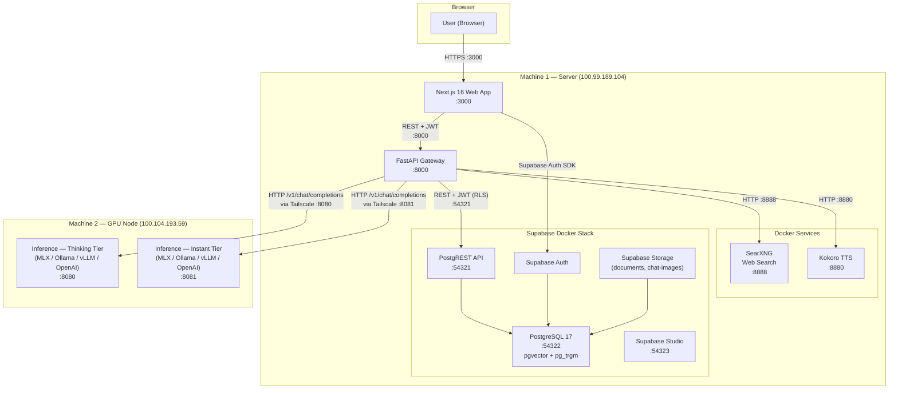


**Key points:**

- Two physical machines connected via **Tailscale VPN** (also supports single-machine deployment)
- Machine 1 runs the web app, gateway, Supabase stack, SearXNG, and Kokoro TTS (all via Docker)
- Machine 2 runs GPU inference servers (supports MLX, Ollama, vLLM, llama.cpp, or OpenAI-compatible APIs)
- All inter-service communication is HTTP; no message queues or gRPC
- Gateway is the central orchestrator — routes to inference, RAG, web search, TTS, and database
- `molebie-ai` CLI manages setup, configuration, and service lifecycle

---

## 2. Request Flow — Chat Completion (Streaming)

The main user-facing flow when sending a chat message, now including web search and RAG context injection:

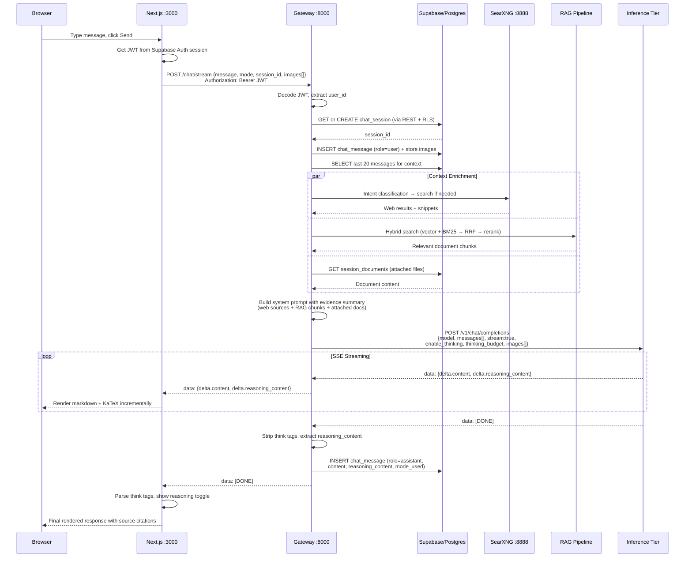


---

## 3. Authentication Flow

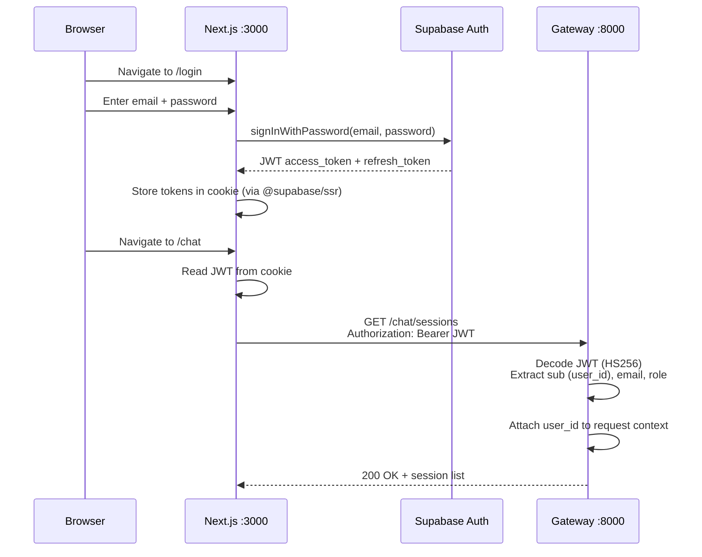


**Auth details:**

- Supabase Auth issues JWTs (HS256, shared secret)
- Gateway decodes JWT locally (no round-trip to Supabase Auth for validation)
- All Supabase DB queries pass the user JWT for Row-Level Security enforcement
- In dev mode, signature verification is skipped for convenience

---

## 4. Inference Mode Routing

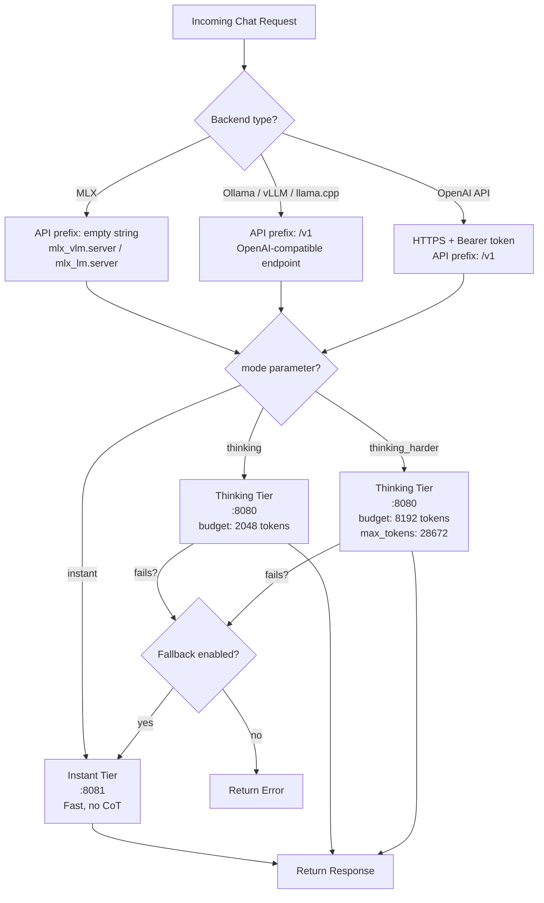


**Cost controls:**

- `THINKING_DAILY_REQUEST_LIMIT` caps heavy inference per user per day (default: 100)
- `THINKING_MAX_CONCURRENT` limits parallel thinking requests (default: 2)
- Fallback to instant tier is configurable via `ROUTING_THINKING_FALLBACK_TO_INSTANT`

**Supported inference backends:**

- **MLX** (Apple Silicon) — `mlx_vlm.server` or `mlx_lm.server`, API prefix `""`
- **Ollama** — HTTP, API prefix `/v1`
- **vLLM** — HTTP, API prefix `/v1`
- **llama.cpp** — HTTP, API prefix `/v1`
- **OpenAI API** — HTTPS with Bearer token, API prefix `/v1`

---

## 5. Web Search Pipeline

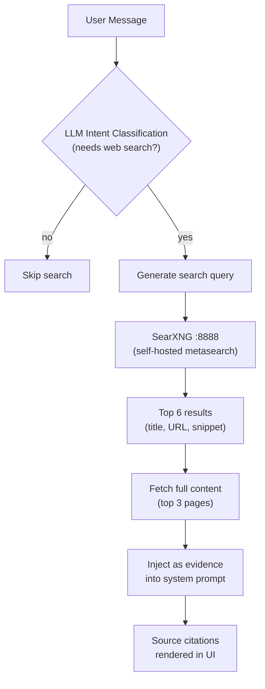

**Web search details:**

- Powered by **SearXNG** — self-hosted, privacy-respecting, no API keys needed
- **LLM intent classification** decides whether a query needs web results (configurable via `WEB_SEARCH_LLM_CLASSIFY`)
- Fetches full page content for top 3 results (up to 2000 chars each)
- Results injected as evidence blocks in the system prompt with quality labels

---

## 6. RAG Pipeline (Document Retrieval)

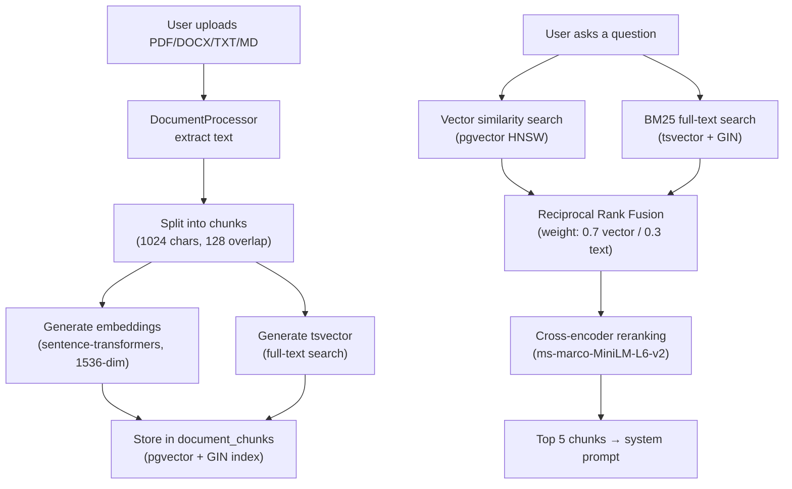

**RAG details:**

- **Hybrid search**: vector similarity (pgvector HNSW) + BM25 full-text (tsvector + GIN) fused via RRF
- **Cross-encoder reranking** for final relevance scoring
- **Contextual retrieval**: LLM generates context prefixes for each chunk at ingest time
- **Session document attachments**: files can be attached to specific sessions and injected directly into the system prompt
- **Embedding model**: configurable (default: `sentence-transformers/all-MiniLM-L6-v2`, 1536-dim via Orange/orange-nomic)
- **RAG metrics**: performance logging with quality tracking

---

## 7. Voice Pipeline

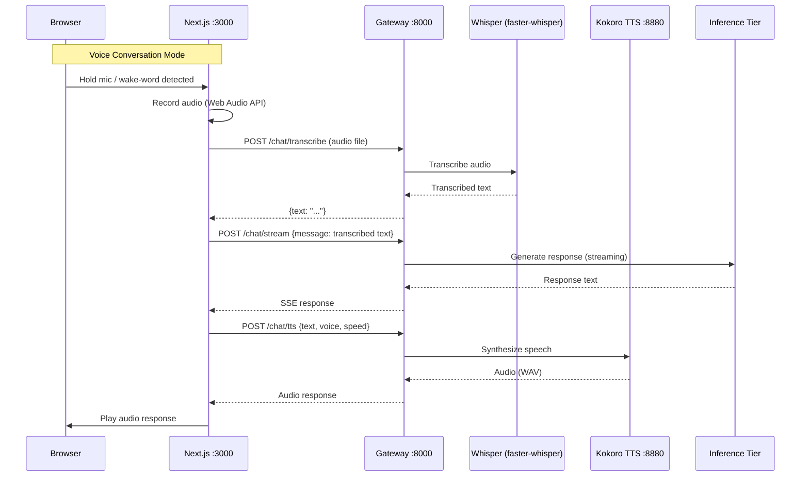

**Voice details:**

- **STT**: `faster-whisper` (local Whisper inference) via `POST /chat/transcribe`
- **TTS**: Kokoro FastAPI (Docker, CPU) with 12 voice options (British/American, male/female)
- **Speaker verification**: enroll voice profile, verify subsequent speakers match
- **Wake-word detection**: browser-side voice activity detection
- **Voice settings**: configurable voice, speed (0.5x–2.0x), auto-read toggle

---

## 8. Database Schema (ER Diagram)

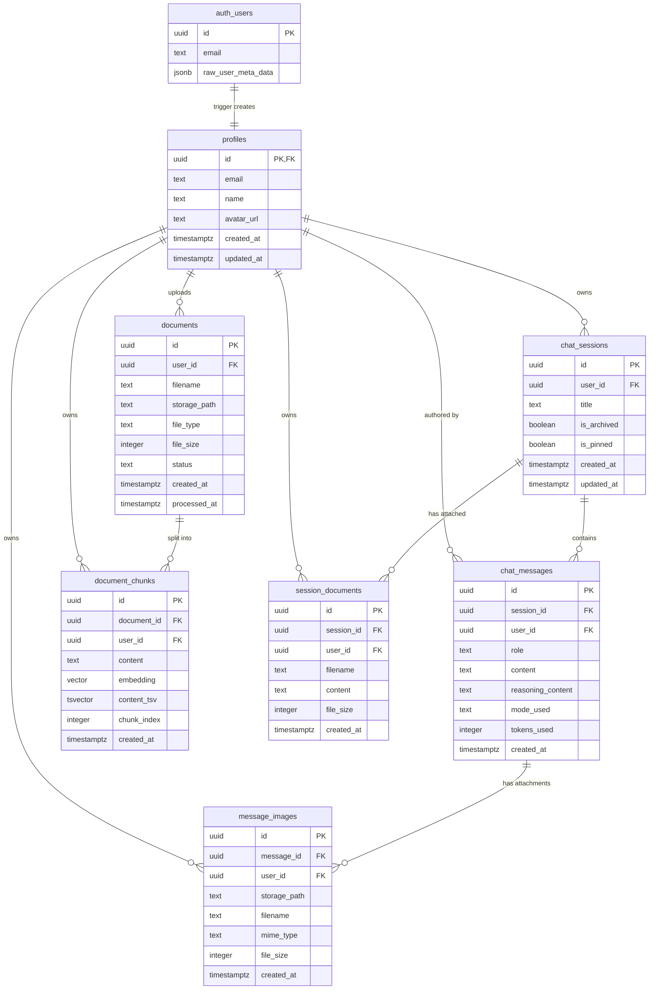


**Key schema features:**

- Row-Level Security on every table (users only see their own data)
- `auth.users` trigger auto-creates a `profiles` row on signup
- `chat_messages` trigger auto-updates `chat_sessions.updated_at`
- pgvector extension with **HNSW index** (M=16, ef_construction=64) for RAG similarity search
- **tsvector + GIN index** on `document_chunks` for BM25 full-text search
- **RRF hybrid search** function in Postgres for vector + BM25 fusion
- `mode_used` supports: `instant`, `thinking`, `thinking_harder`
- `message_images` stored in Supabase Storage (`chat-images` bucket), metadata in table
- `session_documents` holds full-text content injected directly into system prompts
- `chat_sessions.is_pinned` for session pinning/favoriting
- Storage buckets: `documents` (RAG uploads), `chat-images` (inline image attachments)

---

## 9. Gateway API Routes

```
/health
  GET /              — Basic health check
  GET /auth          — JWT validation + user info
  GET /inference     — Inference tier status

/chat
  POST /             — Send message (full response)
  POST /stream       — Send message (SSE streaming)
  GET  /sessions     — List user sessions
  POST /sessions/create  — Create new session
  GET  /sessions/{id}/messages — Get session messages
  PATCH /sessions/{id}   — Rename session
  PATCH /sessions/{id}/pin — Pin/unpin session
  DELETE /sessions/{id}  — Delete session
  POST /transcribe   — Whisper STT (audio → text)
  POST /tts          — Kokoro TTS (text → audio)
  POST /voice-enroll — Voice profile enrollment
  GET  /voice-profile — Get voice profile
  DELETE /voice-profile — Delete voice profile

/documents
  POST /upload       — Upload file for RAG processing
  GET  /             — List user documents
  DELETE /{id}       — Delete document + chunks
  POST /sessions/{id}/attach  — Attach document to session
  DELETE /sessions/{id}/attach — Remove attachment
```

---

## 10. Physical Deployment / Network Topology

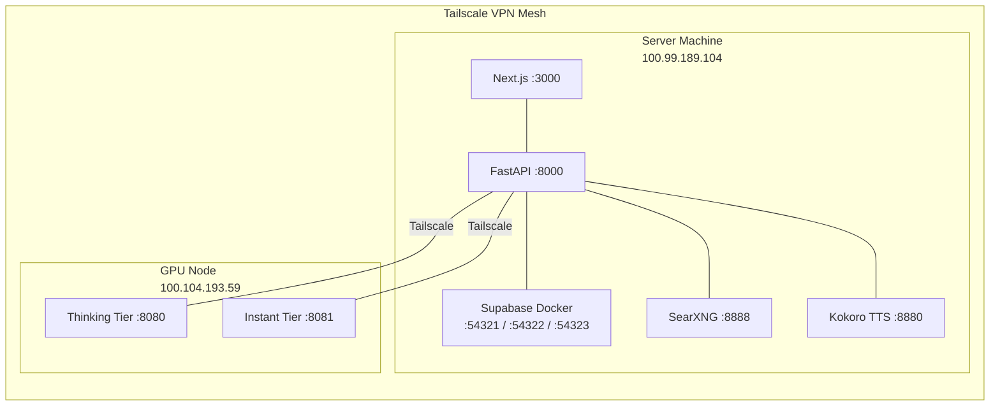

**Deployment modes:**

- **Two-machine**: Gateway/webapp on server, inference on GPU node (Tailscale/LAN)
- **Single-machine**: Everything on localhost (configured via `molebie-ai install`)
- **Auto-pull daemon**: macOS LaunchAgent polls git and auto-updates on new commits

---

## 11. Frontend Page Structure

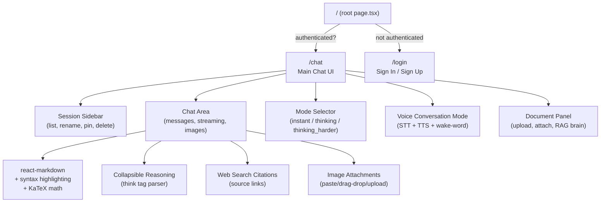


**Frontend stack:** Next.js 16 (App Router), React 19, TypeScript, Tailwind CSS v4, Geist Mono font, dark glass UI theme with green accents. State is managed purely with React hooks (no external state library).

**Key frontend features:**

- Voice conversation mode with wake-word detection and speaker verification
- Document upload/attachment for RAG and per-session context
- Image upload via paste, drag-and-drop, or file picker (stored in Supabase Storage)
- Web search source citations with clickable links
- KaTeX math rendering in messages
- Session pinning/favoriting

---

## 12. CLI Tool (molebie-ai)

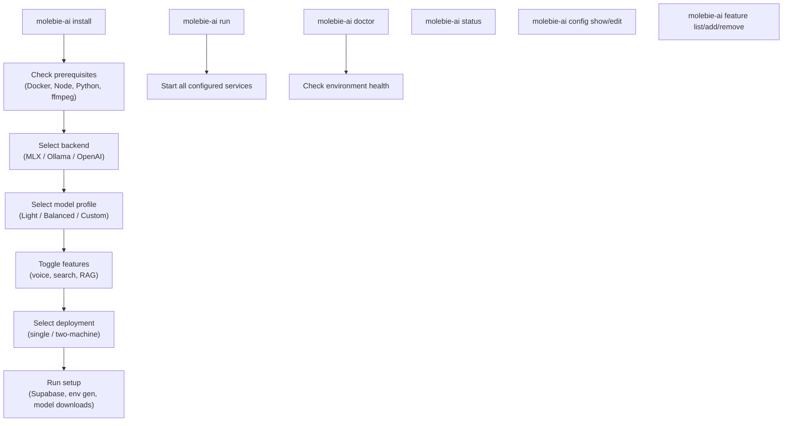

**CLI details:**

- **Framework**: Python + Typer + Rich
- **Entry point**: `molebie-ai` (installed via `pip install -e .`)
- **Config storage**: `.molebie/config.json`
- **Env generation**: Auto-generates `.env.local` from CLI config
- **Prerequisite checker**: Detects and offers to install missing dependencies
- **Service manager**: Starts/stops all services via subprocess

---

## Summary Table

| Service | Port | Framework | Purpose |
|---------|------|-----------|---------|
| **Web App** | 3000 | Next.js 16 | Chat UI, auth, voice, documents, images |
| **Gateway** | 8000 | FastAPI | Auth, routing, DB proxy, inference proxy, RAG, web search, TTS, SSE streaming |
| **Supabase** | 54321-54323 | Docker (Postgres 17) | Auth (JWT), PostgreSQL (RLS, pgvector, pg_trgm), Storage |
| **Thinking LLM** | 8080 | MLX / Ollama / vLLM / OpenAI | Deep reasoning with chain-of-thought |
| **Instant LLM** | 8081 | MLX / Ollama / vLLM / OpenAI | Fast responses, no CoT |
| **SearXNG** | 8888 | Docker | Self-hosted web search (no API keys) |
| **Kokoro TTS** | 8880 | Docker (FastAPI) | Text-to-speech (12 voices, CPU) |
| **Tailscale** | — | VPN mesh | Connects server + GPU node |
| **CLI** | — | Python (Typer) | Setup wizard, service management, diagnostics |

The gateway is the central orchestrator: it authenticates every request, manages sessions/messages in Supabase, routes to the appropriate inference tier, enriches context with web search and RAG results, handles voice transcription and synthesis, manages image attachments, builds evidence-augmented system prompts, handles streaming, extracts reasoning content, and applies cost controls.
